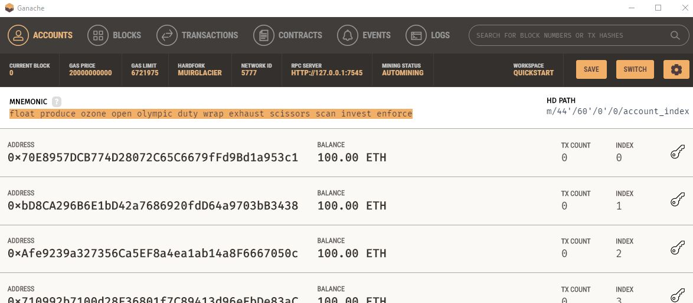
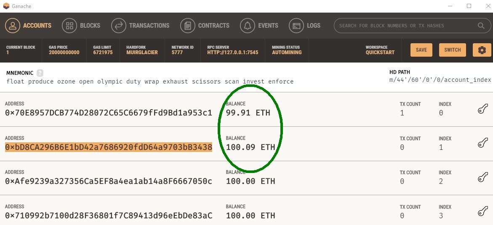
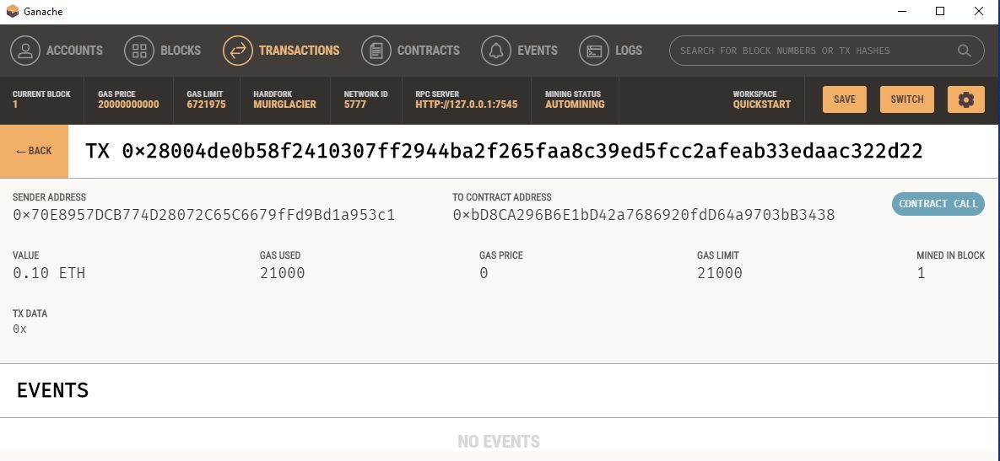

# ganache-eth-payment-system
### Develop a cryptocurrency payment system on a Ganache Ethereum blockchain.

---
## Technologies
### Python Libraries
* streamlit
* dataclasses: dataclass
* typing: Any, List
* os
* dotenv: load_dotenv
* bip44: Wallet
* web3.gas_strategies.time_based
* web3: Web3, Account, middleware

### Local Library:
* crypto_wallet: generate_account, get_balance, send_transaction
---

## Summary
This app expects a Ganache session to be running, and that the corresponding MNEMONIC string and variable has been set in a .env file:
<pre>
MNEMONIC="Ganache MNEMONIC string"
</pre>

Via a Streamlit front-end:
* Select a FinTech developer from a dropdown list
* Select hours worked
* View hourly rate, developer's Ethereum address, and wage to be paid.
* Send Transaction.

NOTE: For demonstration purposes, one of the hardcoded developer Ethereum addresses was changed to match a Ganache account, so that the balance of both the sender and receiver may be seen.

---

## Screenshots

Initial Ganache Accounts:

Front-end after Developer selection:

After **Send Transaction**:

Ganache, showing balance change of both accounts:

Ganache TX detail:

---
## Contributors

[David Jonathan](https://www.linkedin.com/in/david-jonathan-1b9470/)

---
## License

Licensed under the [MIT License](https://github.com/tmbo/questionary/blob/master/LICENSE). Copyright 2022 David Jonathan